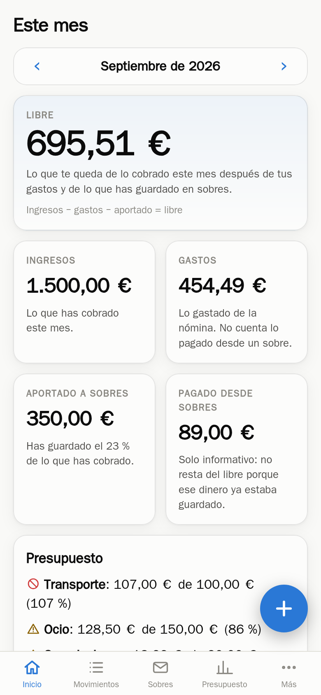
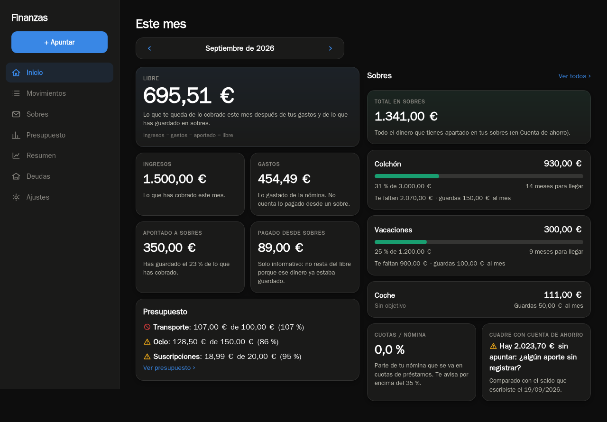
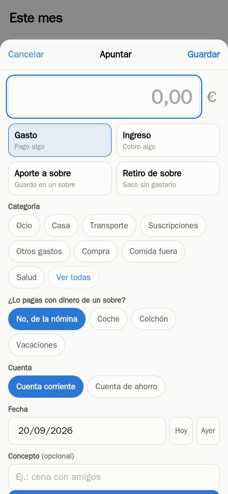
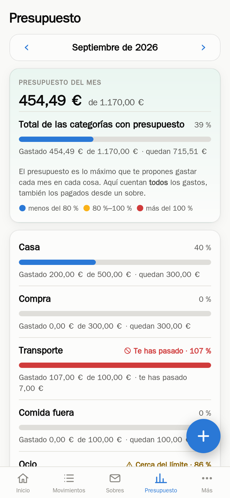

# Finanzas

App web de finanzas personales **para una sola persona**, pensada primero para el
móvil y para tenerla en casa: un contenedor, una base de datos SQLite y ninguna
cuenta en la nube. Sustituye a la típica hoja de cálculo de gastos.

La idea central son los **sobres**: apartas dinero con un nombre («Vacaciones»,
«Coche») y, cuando gastas de ahí, ese gasto no vuelve a restar del dinero libre
del mes, porque ya lo habías guardado.

| Móvil | Ordenador |
|---|---|
|  |  |

| Apuntar en 5 segundos | Presupuesto |
|---|---|
|  |  |

## Qué hace

- **Panel del mes**: ingresos, gastos, lo guardado y el **libre** (ingresos − gastos − aportado).
- **Apuntar rápido**: importe con teclado numérico, cuatro tipos de movimiento y
  las categorías más usadas a un toque. Instalada como PWA, se abre a pantalla completa.
- **Sobres**: objetivo, aporte mensual, barra de progreso y cuánto falta.
  Las **sobras del mes** pueden guardarse solas en el sobre que elijas.
- **Cuadre**: escribes el saldo real de la cuenta donde tienes el ahorro y te dice
  si te falta algo por apuntar.
- **Presupuesto** por categoría, con avisos configurables.
- **Deudas**: cuotas pagadas y pendientes, última cuota y qué parte de la nómina se va en ellas.
- **Resumen** de 12 meses, en tabla y en gráfico.
- **Copias de seguridad** diarias hechas por la propia app, verificadas y rotadas,
  más exportar a CSV/JSON e importar el CSV de una hoja de cálculo.
- **Dos diseños, un solo código**: barra inferior y botón flotante en el móvil;
  menú lateral y contenido a varias columnas a partir de 900 px.

Todo está en castellano, en euros y con fechas dd/mm/aaaa.

## Puesta en marcha

```bash
git clone https://github.com/GodoHZ/cuentas-claras.git && cd cuentas-claras
docker build -t finanzas-app:1.7.0 --build-arg VERSION=1.7.0 .
docker compose up -d
```

Y ya está en `http://127.0.0.1:8095`. Al arrancar con la base de datos vacía crea
un esqueleto de categorías, sobres y dos cuentas, **sin ningún movimiento**;
todo eso se cambia desde Ajustes.

Escucha solo en `127.0.0.1` a propósito: la idea es publicarla detrás de un proxy
inverso con HTTPS (Nginx Proxy Manager, Caddy, Traefik…) o de una VPN tipo
Tailscale. **No tiene cuentas de usuario**, porque es de un solo usuario; en
Ajustes hay un PIN opcional de 4 a 8 cifras.

Variables del contenedor:

| Variable | Para qué | Por defecto |
|---|---|---|
| `TZ` | zona horaria (los meses y «hoy» dependen de ella) | `Europe/Madrid` |
| `DATA_DIR` | dónde vive `finanzas.db` | `/app/data` |
| `BACKUP_DIR` | dónde van las copias | `/app/backups` |
| `BACKUP_SENTINEL` | fichero que debe existir en la carpeta de copias para escribir en ella | vacío (no comprueba) |
| `APP_VERSION` | se enseña en Ajustes y marca la caché del service worker | `dev` |

`BACKUP_SENTINEL` es para cuando las copias van a otro disco: si ese disco no
está montado, la app **no escribe** en el punto de montaje vacío y avisa, en vez
de dejar ficheros escondidos debajo.

## Las reglas, en corto

- Los importes se guardan **en céntimos** (enteros): nada de decimales flotantes.
- Categorías, sobres y cuentas se referencian **por id**: renombrarlos no rompe el historial.
- **Libre del mes** = ingresos − gastos pagados con la nómina − aportado a sobres.
- Un **gasto pagado desde un sobre** no resta del libre (ese dinero ya estaba
  guardado), pero **sí** cuenta en el presupuesto de su categoría.
- **Saldo de un sobre** = aportes − gastos con ese sobre − retiros.
- **Cuadre** = último saldo real escrito − suma de todos los sobres.
- Lo que tiene movimientos solo se puede **archivar**, no borrar; lo que no se ha
  usado nunca se borra del todo.

Todas viven en `app/calc.py`, que son funciones puras sin base de datos, con sus
tests al lado.

## Cómo está hecho

Python 3.12 + FastAPI + SQLite, plantillas Jinja2 con HTMX y Chart.js para el
gráfico. Sin compilar nada: no hay npm ni bundler.

```
app/
  main.py      rutas web y arranque (FastAPI)
  calc.py      las reglas de cálculo, puras y con tests
  views.py     junta datos y reglas para cada pantalla
  repo.py      consultas SQL          db.py       esquema y conexión
  seed.py      esqueleto inicial      backup.py   copias, rotación y restauración
  importer.py  importador de CSV      export.py   exportar a JSON y CSV
  pin.py       PIN opcional           money.py    céntimos y formato español
  templates/   pantallas              static/     CSS, JS e iconos
tests/         pytest, se ejecutan dentro del docker build
scripts/       iconos, despliegue en Portainer, capturas con WebKit
```

Los **tests se ejecutan durante `docker build`**: si falla una regla de cálculo,
no llega a generarse la imagen.

```bash
docker build --target test -t finanzas-test .        # solo los tests
docker build -f scripts/capturas/Dockerfile --target export \
  --output type=local,dest=/tmp/capturas .           # capturas con WebKit, a tamaño iPhone
```

## Copias de seguridad

La app hace una copia al día con la API de copia en caliente de SQLite (la misma
que `sqlite3 .backup`), la comprueba con `PRAGMA integrity_check` y borra las más
viejas. Desde dentro del contenedor:

```bash
docker exec finanzas python -m app.backup lista
docker exec finanzas python -m app.backup copia
docker exec finanzas python -m app.backup comprobar /app/backups/finanzas-2026-09-20.db
docker exec finanzas python -m app.backup restaurar /app/backups/finanzas-2026-09-20.db /tmp/prueba.db
```

Para restaurar de verdad: parar el contenedor, sustituir `data/finanzas.db` por la
copia (borrando los `-wal` y `-shm`) y volver a arrancar.

## Licencia

MIT.
