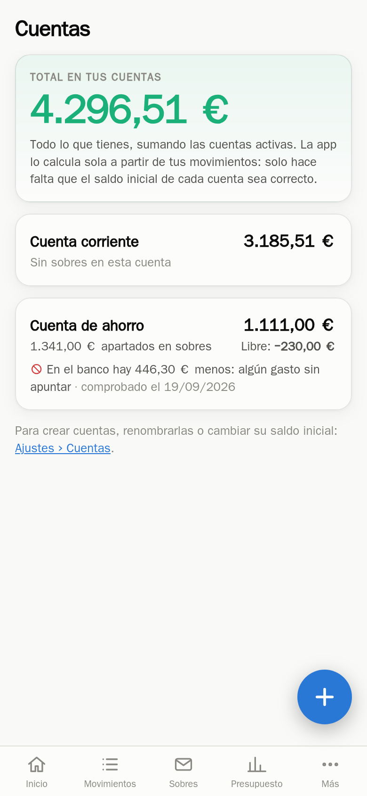

# Finanzas

[](https://github.com/GodoHZ/cuentas-claras/actions/workflows/tests.yml)

App web de finanzas personales **para una sola persona**, pensada primero para el
móvil y para tenerla en casa: un contenedor, una base de datos SQLite y ninguna
cuenta en la nube. Sustituye a la típica hoja de cálculo de gastos.

Dos ideas la sostienen:

- **Cuentas con saldo de verdad**: pones el saldo inicial una vez y la app lo
  calcula sola con tus movimientos. Puedes tener las que quieras (la del día a
  día, la de ahorro, una de comida…) y mover dinero entre ellas con un traspaso.
- **Sobres**: apartas dinero con un nombre («Vacaciones», «Coche») dentro de una
  cuenta y, cuando gastas de ahí, ese gasto no vuelve a restar del dinero libre
  del mes, porque ya lo habías guardado.

| Móvil | Ordenador |
|---|---|
|  |  |

| Apuntar en 5 segundos | Cuentas |
|---|---|
|  |  |

## Qué hace

- **Panel del mes**: ingresos, gastos, lo guardado y el **libre** (ingresos − gastos − aportado).
- **Apuntar rápido**: importe con teclado numérico, cuatro tipos de movimiento y
  las categorías más usadas a un toque. Instalada como PWA, se abre a pantalla completa.
- **Cuentas**: saldo de cada una, cuánto está apartado en sobres y cuánto queda
  libre. Los traspasos mueven dinero entre cuentas sin contar como gasto ni ingreso.
- **Sobres**: objetivo, aporte mensual, barra de progreso y cuánto falta. Cada uno
  vive en una cuenta. Las **sobras del mes** pueden guardarse solas en el que elijas.
- **Cuadre opcional**: apuntas de vez en cuando el saldo que dice el banco y la app
  te avisa si se le ha escapado algo. Un botón deduce el saldo inicial para que cuadre.
- **Presupuesto** por categoría, con avisos configurables.
- **Deudas**: cuotas pagadas y pendientes, última cuota y qué parte de la nómina se va en ellas.
- **Resumen** de 12 meses, en tabla y en gráfico.
- **Copias de seguridad** diarias hechas por la propia app, verificadas y rotadas,
  más exportar a CSV/JSON e importar el CSV de una hoja de cálculo.
- **Dos diseños, un solo código**: barra inferior y botón flotante en el móvil;
  menú lateral y contenido a varias columnas a partir de 900 px.
- **Funciona sin conexión**: guarda la última versión de cada pantalla para poder
  consultarla, y lo que apuntes sin red se queda en el móvil y se envía solo al
  volver. Cada movimiento lleva un identificador propio, así que un reenvío nunca
  duplica nada. Con el PIN activado no se guarda ninguna copia en el móvil.
- **Gestos de móvil**: deslizar un movimiento hacia la izquierda para borrarlo,
  tirar hacia abajo para actualizar y transiciones suaves entre pantallas.

Todo está en castellano, en euros y con fechas dd/mm/aaaa.

## Puesta en marcha

```bash
git clone https://github.com/GodoHZ/cuentas-claras.git && cd cuentas-claras
docker build -t finanzas-app:2.0.0 --build-arg VERSION=2.0.0 .
docker compose up -d
```

Y ya está en `http://127.0.0.1:8095`. Al arrancar con la base de datos vacía crea
un esqueleto de categorías, sobres y dos cuentas, **sin ningún movimiento**;
todo eso se cambia desde Ajustes.

Las carpetas `data/` y `backups/` vienen en el repositorio (vacías) para que sean
tuyas y no de root. El contenedor corre como el usuario `1000:1000`; si el tuyo
es otro, cambia esa línea del `docker-compose.yml` por lo que diga `id -u`.

## Hasta dónde llega la seguridad

Conviene decirlo claro antes de que la pongas en marcha:

- **No la expongas a internet.** Escucha solo en `127.0.0.1` a propósito. La idea
  es llegar a ella por una VPN (Tailscale, WireGuard) o, como mucho, por un proxy
  inverso con HTTPS dentro de tu red (Nginx Proxy Manager, Caddy, Traefik…).
- **No tiene cuentas de usuario**: es para una persona. Cualquiera que llegue a la
  dirección entra, salvo que actives el PIN.
- **El PIN es una barrera ligera**, no una cerradura: 4 a 8 cifras, guardado con
  PBKDF2 y con un bloqueo de 5 minutos tras 5 intentos. Sirve para que nadie
  cotillee si le dejas el móvil desbloqueado; no para aguantar a alguien decidido.
- **La base de datos no está cifrada.** Quien tenga acceso al fichero, tiene tus
  números. Cífralo desde abajo (disco, LUKS...) si te preocupa.
- **Las copias en el móvil** (Ajustes → Sin conexión) se pueden leer sin el PIN,
  porque sin red no hay servidor que lo compruebe. Por eso, con PIN, vienen
  apagadas y la propia app te avisa al activarlas.

Variables del contenedor:

| Variable | Para qué | Por defecto |
|---|---|---|
| `TZ` | zona horaria (los meses y «hoy» dependen de ella) | `Europe/Madrid` |
| `DATA_DIR` | dónde vive `finanzas.db` | `/app/data` |
| `BACKUP_DIR` | dónde van las copias | `/app/backups` |
| `BACKUP_SENTINEL` | fichero que debe existir en la carpeta de copias para escribir en ella | vacío (no comprueba) |
| `APP_VERSION` | se enseña en Ajustes y marca la caché del service worker | `dev` |

`BACKUP_SENTINEL` es para cuando las copias van a otro disco: si ese disco no
está montado, la app **no escribe** en el punto de montaje vacío y avisa, en vez
de dejar ficheros escondidos debajo.

## Las reglas, en corto

- Los importes se guardan **en céntimos** (enteros): nada de decimales flotantes.
- Categorías, sobres y cuentas se referencian **por id**: renombrarlos no rompe el historial.
- **Libre del mes** = ingresos − gastos pagados con la nómina − aportado a sobres.
- Un **gasto pagado desde un sobre** no resta del libre (ese dinero ya estaba
  guardado), pero **sí** cuenta en el presupuesto de su categoría.
- **Saldo de un sobre** = aportes − gastos con ese sobre − retiros.
- **Saldo de una cuenta** = saldo inicial + ingresos − gastos ± traspasos. Un aporte
  a un sobre mueve dinero solo si dices de qué cuenta sale; si no, solo lo aparta.
- **Libre en una cuenta** = su saldo − lo que tienen los sobres que viven en ella.
- **Cuadre** = lo que dice el banco − lo que calcula la app.
- Lo que tiene movimientos solo se puede **archivar**, no borrar; lo que no se ha
  usado nunca se borra del todo.

Todas viven en `app/calc.py`, que son funciones puras sin base de datos, con sus
tests al lado.

## Cómo está hecho

Python 3.12 + FastAPI + SQLite, plantillas Jinja2 con HTMX y Chart.js para el
gráfico. Sin compilar nada: no hay npm ni bundler.

```
app/
  main.py      rutas web y arranque (FastAPI)
  calc.py      las reglas de cálculo, puras y con tests
  views.py     junta datos y reglas para cada pantalla
  repo.py      consultas SQL          db.py       esquema y conexión
  seed.py      esqueleto inicial      backup.py   copias, rotación y restauración
  importer.py  importador de CSV      export.py   exportar a JSON y CSV
  pin.py       PIN opcional           money.py    céntimos y formato español
  templates/   pantallas              static/     CSS, JS e iconos
tests/         pytest, se ejecutan dentro del docker build
scripts/       iconos, despliegue en Portainer, capturas con WebKit
```

Los **tests se ejecutan durante `docker build`**: si falla una regla de cálculo,
no llega a generarse la imagen.

Si vas a tocar el código en tu propia copia, hay un hook que impide commitear
datos privados (rutas, dominios, `.db`, ficheros de configuración local):

```bash
git config core.hooksPath scripts/git-hooks
```

La lista de cosas a vigilar se lee de `~/.config/finanzas/patrones-privados.txt`
(una expresión por línea) y no está en el repositorio, por razones obvias.

```bash
docker build --target test -t finanzas-test .        # solo los tests
docker build -f scripts/capturas/Dockerfile --target export \
  --output type=local,dest=/tmp/capturas .           # capturas con WebKit, a tamaño iPhone
```

## Copias de seguridad

La app hace una copia al día con la API de copia en caliente de SQLite (la misma
que `sqlite3 .backup`), la comprueba con `PRAGMA integrity_check` y borra las más
viejas. Desde dentro del contenedor:

```bash
docker exec finanzas python -m app.backup lista
docker exec finanzas python -m app.backup copia
docker exec finanzas python -m app.backup comprobar /app/backups/finanzas-2026-09-20.db
docker exec finanzas python -m app.backup restaurar /app/backups/finanzas-2026-09-20.db /tmp/prueba.db
```

Para restaurar de verdad: parar el contenedor, sustituir `data/finanzas.db` por la
copia (borrando los `-wal` y `-shm`) y volver a arrancar.

## Licencia

MIT.
